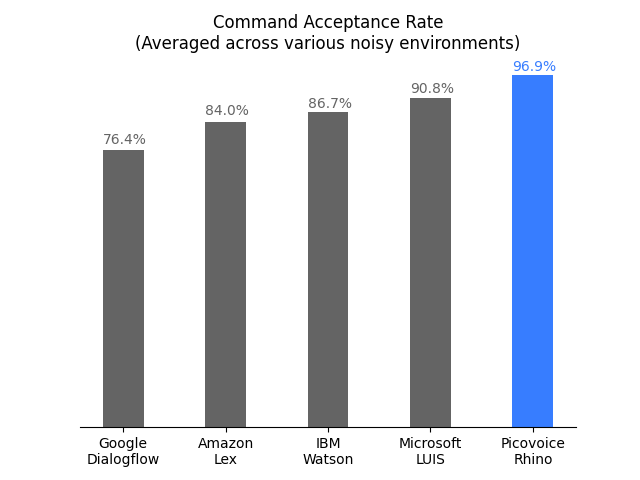

# Picovoice

Made in Vancouver, Canada by [Picovoice](https://picovoice.ai)

Picovoice is the end-to-end platform for building voice products on your terms. Unlike Alexa and Google services,
Picovoice runs entirely on-device while being more accurate. Using Picovoice, one can infer a user’s intent from a
naturally spoken utterance such as:

> "Hey Edison, set the lights in the living room to blue."

Picovoice detects the occurrence of the custom wake word ("Hey Edison"), and then extracts the intent from the follow-on
spoken command:

```json
{
  "intent": "changeLightColor",
  "slots": {
    "location": "living room",
    "color": "blue"
  }
}
```

## Why Picovoice?

- **Private & Secure:** Everything is processed offline. Intrinsically private; HIPAA and GDPR compliant.
- **Accurate:** Resilient to noise and reverberation. Outperforms cloud-based alternatives by wide margins.
- **Cross-Platform:** Design once, deploy anywhere. Build using familiar languages and frameworks.
- **Self-Service:** Design, train, and test voice interfaces instantly in your browser, using Picovoice Console.
- **Reliable:** Runs locally without needing continuous connectivity.
- **Zero Latency:** Edge-first architecture eliminates unpredictable network delay.

## Table of Contents
- [Picovoice](#picovoice)
  - [Why Picovoice?](#why-picovoice)
  - [Table of Contents](#table-of-contents)
  - [Performance](#performance)
  - [Demos](#demos)
    - [NodeJS Demos](#nodejs-demos)
    - [Python Demos](#python-demos)
    - [Android Demos](#android-demos)
    - [iOS Demos](#ios-demos)
  - [SDKs](#sdks)
      - [NodJS](#nodejs)
      - [Python](#python)
  - [Releases](#releases)

## Performance

Picovoice makes use of the [Porcupine wake word engine](https://github.com/Picovoice/porcupine) to detect utterances of
given wake phrases. An open-source benchmark of Porcupine is available
[here](https://github.com/Picovoice/wakeword-benchmark). In summary, compared to the best-performing alternative,
Porcupine's standard model is **5.4 times more accurate**.


Picovoice relies on the [Rhino Speech-to-Intent engine](https://github.com/Picovoice/rhino) to directly infer user's
intent from spoken commands within a given domain of interest (a "context"). An open-source benchmark of Rhino is
available [here](https://github.com/Picovoice/speech-to-intent-benchmark). Rhino outperforms all major cloud-based
alternatives with wide margins.



## Demos

Of using SSH, clone the repository with:


```bash
git clone --recurse-submodules git@github.com:Picovoice/picovoice.git
```

If using HTTPS, then type

```bash
git clone --recurse-submodules https://github.com/Picovoice/picovoice.git
```

### NodeJS Demos

We have provided an NPM package with file-based and microphone Picovoice demos. You can do a global NPM install to make
the `pv-file-demo` and `pv-mic-demo` commands available.

```bash
npm install -g @picovoice/picovoice-node-demo
```

```bash
pv-file-demo --help
pv-mic-demo --help
```

The file demo will allow you to test Picovoice against a WAV file that meets the audio processing requirements. The
microphone demo requires you to setup dependencies that are **not included with NPM**. Please see the
[demo instructions](./demo/nodejs) for details.

### Python Demos

Install [PyAudio](https://people.csail.mit.edu/hubert/pyaudio/) and then the demo package

```bash
sudo pip3 install picovoicedemo
```

Check usage information

```bash
picovoice_demo_mic --help
picovoice_demo_file --help
```

The microphone demo opens an audio stream from a microphone, detected utterances of a given wake phrase, and infers
intent from the follow-on spoken command. The file demo is useful for processing prerecorded audio file(s). After
pressing the start button say:

> Porcupine, set the lights in the living room to purple.

### Android Demos

Using Android Studio, open [demo/android/Activity](/demo/android/Activity) as an Android project and then run the
application. Press the start button and say

> Porcupine, turn of the lights in the kitchen.

For the full set of commands supported in the context refer to [demo's readme](/demo/android/README.md).

### iOS Demos

Using Xcode, open [demo/ios/PicovoiceDemo/PicovoiceDemo.xcodeproj](/demo/ios/PicovoiceDemo/PicovoiceDemo.xcodeproj) and
run the application. Press the start button and say

> Porcupine, make the living room lights brighter.

For the full set of commands supported in the context refer to [demo's readme](/demo/android/README.md).

## SDKs

### NodeJS

The Picovoice SDK for NodeJS is available from NPM:

```bash
yarn add @picovoice/picovoice-node
```

(or)

```bash
npm install @picovoice/picovoice-node
```

The SDK provides the `Picovoice` class. Create an instance of this class using a Porcupine keyword and Rhino context
file, as well as callback functions that will be invoked on wake word and inference events, respectively:

```javascript
const Picovoice = require("@picovoice/picovoice-node");

let keywordCallback = function (keyword) {
  console.log(`Wake word detected`);
};

let inferenceCallback = function (inference) {
  console.log("Inference:");
  console.log(JSON.stringify(inference, null, 4));
};

let handle = new Picovoice(
  keywordArgument,
  keywordCallback,
  contextPath,
  inferenceCallback
);
```

The `keywordArgument` can either be a path to a Porcupine keyword file (.ppn), or one of the built-in keywords
(integer enums). The `contextPath` is the path to the Rhino context file (.rhn).

Upon constructing the Picovoice class, send it frames of audio via its `process` method. Internally, Picovoice will
switch between wake word detection and inference. The Picovoice class includes `frameLength` and `sampleRate` properties
for the format of audio required.

```javascript
// process audio frames that match the Picovoice requirements (16-bit linear pcm audio, single-channel)
while (true) {
  handle.process(frame);
}
```

As the audio is processed through the Picovoice engines, the callbacks will fire. This is the output when we provide the
built-in "picovoice" keyword and [sample "coffee maker" context](./resources/rhino/resources/contexts) to the Picovoice
class, and then provide it a [test WAV file](./resources/audio_samples/picovoice-coffee.wav) that contains the following
utterance:

> Picovoice, make me a large coffee

```bash
Wake word detected

Inference:
{
    "isUnderstood": true,
    "intent": "orderDrink",
    "slots": {
        "size": "large",
        "coffeeDrink": "coffee"
    }
}
```

### Python

### Android

### iOS

## Releases

### v1.0.0 - October 22, 2020

- Initial release.
